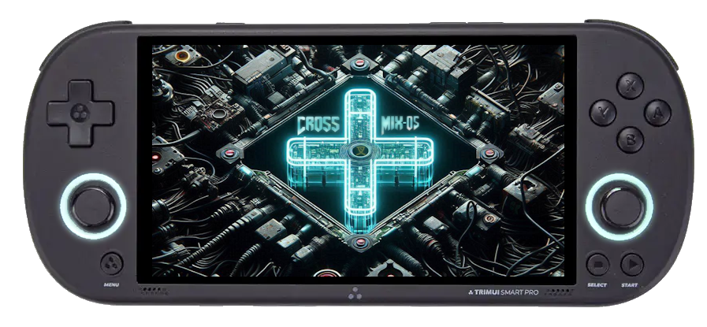
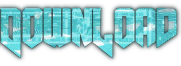

    
    
_Get the best from your TrimUI Smart Pro_  

  

---

*   [Introduction](#Introduction)
*   [Installation & Update](#installation--update)
*   [Apps](#Apps)
*   [System Tools](#System-Tools)
*   [Shortcuts](#Shortcuts)
*   [FAQ](#FAQ)
*   [How to Start Netplay](#How-to-Start-Netplay)
*   [Special Thanks](#Special-Thanks)
*   [Some words from the author](#Some-words-from-the-author)
*   [Help the CrossMix-OS project](#Help-the-CrossMix-OS-project)
    
---

# Introduction

CrossMix-OS is based on TrimUI stock firmware with a more advanced configuration,
new emulators and new tools to offer an optimal experience on your TrimUI Smart Pro.

CrossMix-OS is also designed for the community, developers and creators: it supports themes, icon packs, background packs, template for "Best" collections, overlays auto config, …

All components of CrossMix-OS are free and open source.

---

# Installation & Update

## **To make a fresh install:**
- Format your SD card in FAT32. (use a genuine, name-brand SD card and not the stock one sold with your console)*
- Download the [latest release of CrossMix-OS](https://github.com/cizia64/CrossMix-OS/releases/latest) (in the "assets", at the bottom of the release page, look for "CrossMix-OS_v1.x.x.zip")
- Extract the archive to the root of your formatted SD card.
- Copy your BIOS files into the `BIOS` folder (on stock SD card copy it from `RetroArch/.retroarch/system` to `BIOS` folder)
- Copy your own ROMs into the `Roms` folder (or copy the `Roms` folder from stock SD card, rom path changes : PPSSPP -> PSP , OPERA -> PANASONIC , PICO8 -> PICO)
- Insert your SD card into your TrimUI Smart Pro and boot the console.

## **To update from a previous CrossMix Version**
- Run chkdsk/fsck on your SD card first (as there are many bad SD cards, it's always a good idea to check for errors)
- Copy the archive "CrossMix-OS_v1.x.x.zip" (not decompressed) on SD card root
- update the file `_FirmwareCheck.sh` located in `System/starts` with the new version from the archive "CrossMix-OS_v1.x.x.zip" or [from here](https://raw.githubusercontent.com/cizia64/CrossMix-OS/main/System/starts/_FirmwareCheck.sh)], that's all.
- At reboot the update will be automatically installed

Notes about the automatic update:
The following folders are not modified during the update: 
- SDCARD/Data
- SDCARD/BIOS
- SDCARD/Best
- SDCARD/Imgs
- SDCARD/Roms
The automatic update process will move your previous files in "SDCARD/_Updates" folder. You'll also find the migration log in this directory.
The saves/savestates from Retroarch, PPSSPP, Drastic are automatically copied from the backup to the new installation.

## **To migrate from an another OS version (Stock/Tomato)**

You can't just override the files to have a good result. Do not use the stock SD card (otherwise you'll have corruption of filesystem very often and loosing files). 
This procedure is to migrate to CrossMix on a guenuine SD card which is already used for another OS. The process is similar with a separate/dedicated SD card except that you copy the stock files from the other SD card instead of "\_Mybackup" folder.

* make a scandisk on your SD card (important because many SD card filesystem are already partially corrupted before installing)
* create a folder called "\_Mybackup" for example and put all your existing files/folders in it. You now have only one folders on your SD card.
* extract the CrossMix archive on your SD card root.
* copy your BIOS files into the BIOS folder (on stock SD card copy it from `/_Mybackup/RetroArch/.retroarch/system to BIOS folder` to `/BIOS`)
* move Roms folders **but don't import roms folders which are not coming from CrossMix** ! Some name are different: PPSSPP -> PSP , OPERA -> PANASONIC , PICO8 -> PICO (so for example copy the content of `_Mybackup/Roms/PPSSPP/*` in `Roms/PSP`)
* Insert your SD card into your TrimUI Smart Pro and boot the console.
* Refresh roms

**About saves and save states:**

* The save states made with the in game menu are contained in Roms folder, most of them should work directly except if the core is different: in this case the content folder will not have the same name.
* if you really need some save and save states from Retroarch the paths have changed for a more clean organization. It's probably easier to make a save with the in game menu before migrate to CrossMix, otherwise the migration is manual: the base folder is the same (`RetroArch\.retroarch\saves` and `RetroArch\.retroarch\states`) but on CrossMix it is `RetroArch\.retroarch\saves\**RomFolderName**\**Corename**` .

For example : `RetroArch\.retroarch\saves\001 Donkey Kong Land.srm` wil go into : `RetroArch\.retroarch\saves\GB\Gambatte`

## Remarks

**Remark:** CrossMix-OS doesn't require any firmware update before installation: it will guide you to update it if required, just let yourself be guided on the first boot.

**Remark:** CrossMix-OS use the firmware 1.0.4 hotfix 6 by default (no need to update it before your CrossMix installation), hotfix 9 is also supported but boot logo change is disabled.

---

# Apps

### Scraper

- Automatically download all the box arts for a platform.
- based on [screenscraper from Schmurtz](https://github.com/schmurtzm/TrimUI-Smart-Pro/tree/main/Scraper)] & sselph/scraper.

### EmuCleaner

- Automatically displays emulators with present ROMs and hides others.
- Run EmuClean after adding a pack of games to update emulator visibility.

### Bootlogo

- Choose and flash your own boot logo with basic verification (file size, format, resolution).
- Add your own logos to `SDCARD/Apps/BootLogo/Images`.  

**Note: this is not compatible with firmwares after 1.0.4 hotfix 6**

### Screen Recorder

- Capture your screen by launching the app. Launch again to stop recording.

### Moonlight

- Stream your PC screen to your TrimUI Smart Pro.

### PortMaster

- Manage and install new ports.

### USB Storage Mount

- Access your SD card without removing it from your TrimUI Smart Pro by connecting it via USB.

### Random Game Picker

- Will choose a random game for you (Press A to launch, X to skip, B to quit)

---

# System Tools

### Emulators

- **Auto load state**: Resume your game systematically where you left off.
- **Resume at boot**: Quit and power off completely with the POWER button. Resume where you left off on the next boot.
- **Overlays selector**: Configure your default display for all platforms.
- **PSX Analog detector**: Detects PSX games compatible with analog sticks and sets the right controller configuration.

### LEDs Section

- Configure default LED behavior (persistent after reboot).

### Network

- Display current IP.
- FTP and HTTP file server.
- SSH server.
- Telnet server
- Syncthing server

### Themes

- Icon collection selector.
- Background collection selector.
- Sound settings (enable/disable music and clicks).
- Hide the top-left logo.
- Sort Themes alphabetically 

### Tools

- Force CPU to max speed until the next reboot.
- **Cue generator**: Create `.cue` files for PSX `.bin` files.
- Alphabetically sort favorites.
- **M3U**: Playlist creator for PSX games.
- **UDISK format**: Utilize 6GB internal storage (for advanced users only).

### User Interface

- **Best Collection**: Improve look & feel of the best collection, including icons and platform renaming.
- **Start Tab**: Select the default tab at boot (Best, Game, Favorite, etc.).
- Refresh System Tools Menu: to refresh System Tools Menu (will detect new scripts, new wallpaper/icon packs)

---

# Shortcuts

### MainUI

- **START**: Switch between cover flow view and grid view.
- **Select**: Search through all your games (also accessible via the menu button).
- **MENU on Game/Best/Apps list**: Select "edit" to hide unwanted items.
- **Resume at boot**: Press MENU during the entire boot process until the 3 blue LED flashes to skip.

### General Controls

- **Start + L/R**: Change luminosity at any time.
- **FN key**: Set CPU speed to maximum performance (customizable in apps).

### In-Game Controls

- **Menu + Power (3 seconds)**: Force exit the current game (useful in case of crash/freeze).
- **Long press Power**: Save and power off (available if "Resume at boot" is enabled in the System Tools app).
- **Display FPS**: Select + X.
- **Fast forward**: Select + R1.
- **Rewind**: Select + L1 (requires enabling in Retroarch, impacts performance).
- **Save state in current slot**: Select + R2.
- **Load save state from current slot**: Select + L2.
- **Previous save state slot**: Select + D-Pad Left.
- **Next save state slot**: Select + D-Pad Right.
- **Screenshot**: Menu + D-Pad UP.
- **Quick quit**: Select + Start.

---

# FAQ

- **My TSP resumes a crashed game**: Press the Menu button during the entire boot time.
- **PSX bin files not displayed**: Use the Cue generator in System Tools to generate `.cue` files.
- **Disabling overlays**: Use the "Overlays" tool in System Tools to disable overlays for all emulators in one click.
- **Overlay settings issue**: If the max ratio overlay isn't found, the pixel perfect overlay will be used instead.
- **Device doesn't boot, black screen**: Press the power button for 10 seconds and try again. Restore the default boot logo if necessary.
- **PSX gamepad configuration issues**: Use the "PSX Analog detector" for correct configuration.
- **Current game is frozen**: Press Menu and Power for 3 seconds to force exit the game.
- Retroarch configuration ovverides: CrossMix OS uses "directory overrides" everywhere. This is the best choice : in many handhelds OS it works with core overrides but this has no sense as some cores are used for multiple platforms. 
So Directory override is a nice choice but there is an enormous limitation : when you have rom subfolders (for example "GBA/modern games") Retroarch will look for a "modern games" override instead of "GBA" override, fortunately this limitation is managed in CrossMix-OS thanks to [FolderOverrideFinder.sh created by Schmurtz](https://github.com/cizia64/CrossMix-OS/commit/49faff09c4cf30534cc722cc53a309db3a78be3b).

---

# How to Start Netplay

1. Ensure all players have the same game ROM.
2. Connect all players to the same WLAN (or host-created hotspot).
3. Enable netplay in the "System" menu.
4. Host player enters the game.
5. Other players join the hosted game under "Netplay" after the host begins playing.

---

# Special Thanks

- **cobalt** : For his numerous contributions to the project.
- **Christian_Haitian**: For all his work on aarch64 architecture, ports, and cores.
- **PortMaster Team** and **kloptops**: For the TrimUI version and his tools.
- **Schmurtz**: System Tools and Scraper apps and invaluable help and advice.
- **Djware**: Many [TrimUI apps](https://github.com/djware/TrimUITools).
- **TenLevels & Skylance**: For their work on themes.
- **Onion Team**:  For their work on Onion-OS, a real source of inspiration for CrossMix-OS.
- **kx230**, **tomato**, **Nevrdid** : For their daily advices and contributions.
- **TrimUI Community**: contributions from many members of the TrimUI community!

---

# Some words from the author

I'm Cizia, a passionate retrogamer. I love the TrimUI Smart Pro, but I felt it deserved a more mature OS, better configured, and with more options. I worked tirelessly to create an image that meets my standards, and today, I'm sharing it with you.

There are some features I'm particularly proud of, such as:

- **Background and icon selectors**: it completes well the native theme selector.
- **Overlay selector**: Configure your default display ratio and overlay in one click for all platforms, plus new dedicated overlays.
- **SwanStation 16/9 mode launcher**.
- **Extensive work on emulator launchers and configuration**.
- **Default customization of the OS**: custom theme, icons and backgrounds, Polish language added and many new tools.
- **Firmware Update Wizard**: an automatic guide to help user to update if necessary.
- **Best packs standardization**: generic launcher, game shortcuts support and images on folders.

I would also like to extend a warm thank you to Kloptops for [PortMaster and his tools](https://github.com/kloptops/TRIMUI_EX) which are deeply used in CrossMix-OS.

Thanks to Schmurtzm for his numerous scripts, I have revised and integrated them into CrossMix-OS, which have greatly enhanced the available features:
- [PSX Analog Detector](https://github.com/schmurtzm/TrimUI-Smart-Pro/blob/main/SystemTools/Apps/SystemTools/Menu/EMULATORS/PSX%20Analog%20Detector.sh): Detects PSX games compatible with analog sticks and automatically sets the correct controller configuration.
- [BootLogo](https://github.com/schmurtzm/TrimUI-Smart-Pro/tree/main/Bootlogo): An app for easy boot logo flashing on TrimUI Smart Pro.
- [EmuCleaner](https://github.com/schmurtzm/TrimUI-Smart-Pro/tree/main/EmuCleaner): An app to display only emulators with ROMs installed.
- [System Tools](https://github.com/schmurtzm/TrimUI-Smart-Pro/tree/main/SystemTools): An app to centralize different apps/scripts in one place.
- [Resume at Boot](https://github.com/schmurtzm/TrimUI-Smart-Pro/tree/main/ResumeAtBoot): A set of scripts to add a resume game on startup feature.
- [Subfolder config override finder](https://github.com/libretro/RetroArch/issues/12021#issuecomment-2107300989) is also used in CrossMix-OS.
- [Scraper](https://github.com/schmurtzm/TrimUI-Smart-Pro/tree/main/Scraper): an app to automatically download boxarts.

I hope CrossMix-OS will become a reference among OSes based on the stock OS and continue to improve with community support.

## Help the CrossMix-OS project

I have more ideas and improvements for this project, and you might have some too. Don't hesitate to share them!

Contribute to this repo by making a Pull Request. If you have an improvement to propose and don't know how to use GitHub, send me a message!

Feel free to reach out to me to report bugs, request features, or just chat on **[Discord](https://discord.gg/Jd2azKX)** or on **[Github Issues](https://github.com/cizia64/CrossMix-OS/issues?q=is%3Aissue+is%3Aopen+sort%3Aupdated-desc)**

If you enjoy my work and want to support the countless hours/days invested, here are my sponsors:

- 
- 
- 

