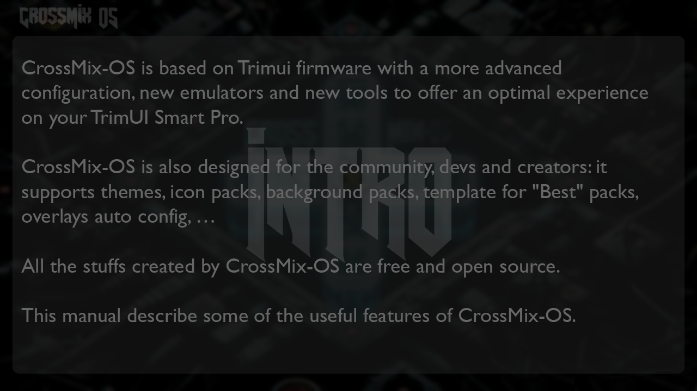
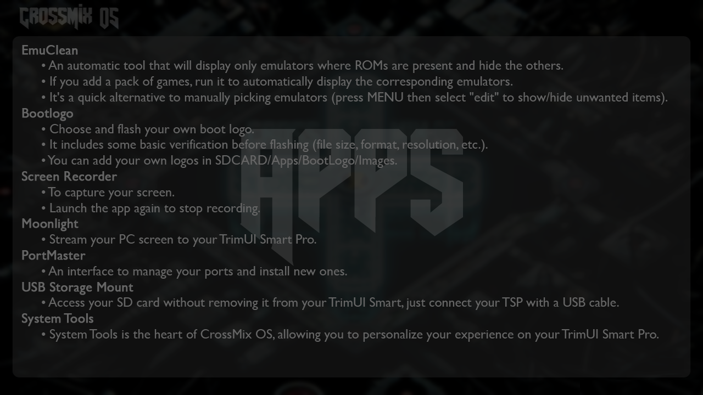
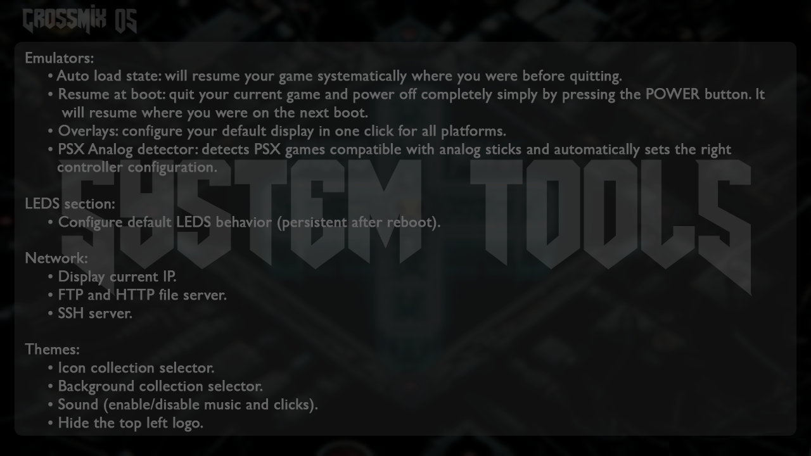
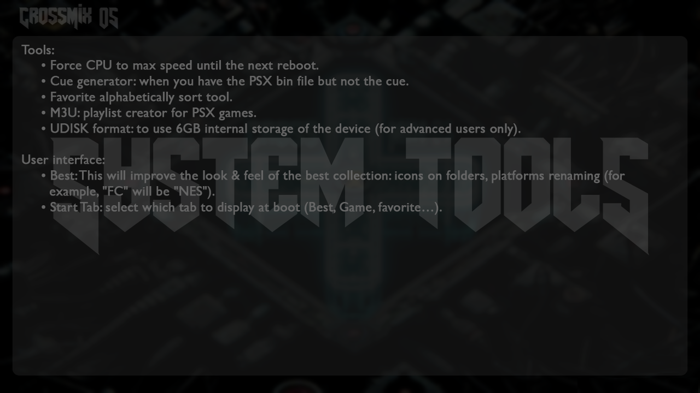
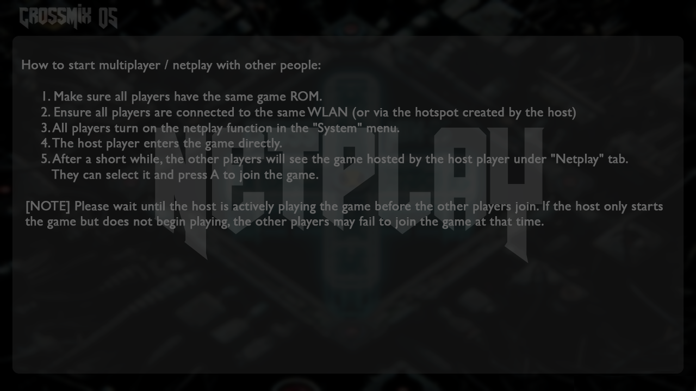
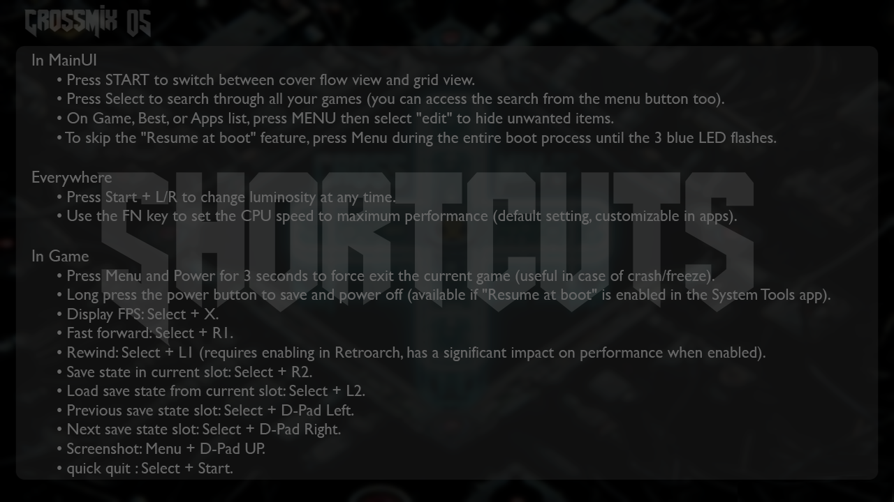
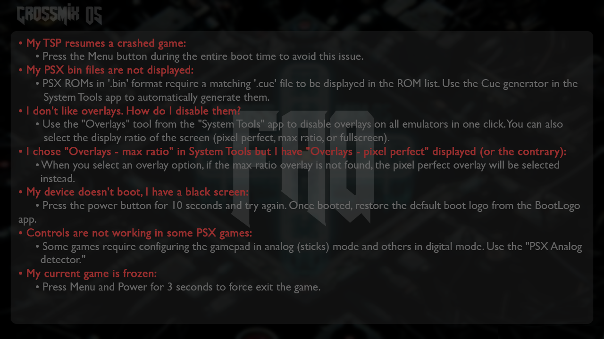
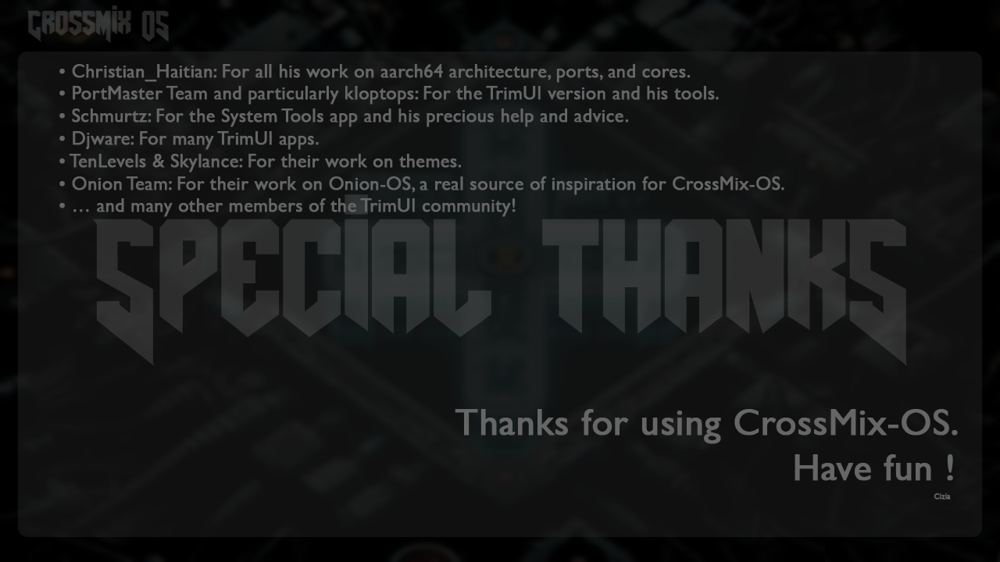

    
    
_Get the best from your TrimUI Smart Pro_  

 

  

---

*   [Introduction](#installation)
*   [Apps](#features)
*   [System Tools](#features)
*   [Netplay](#features)
*   [Shortcuts](#features)
*   [FAQ](#features)
*   [Special Thanks](#features)
    

## Introduction

## Apps

## System Tools

## Netplay

## Shortcuts

## FAQ

## Special Thanks

